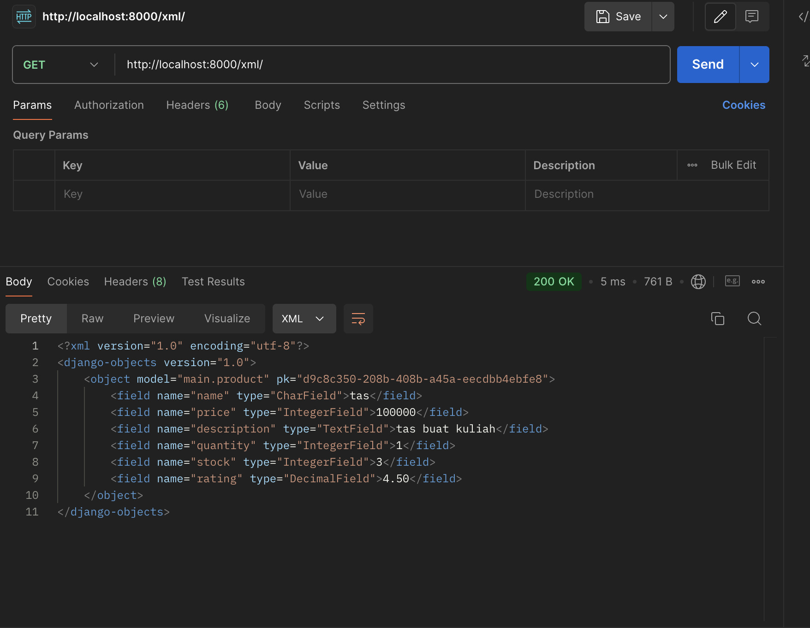
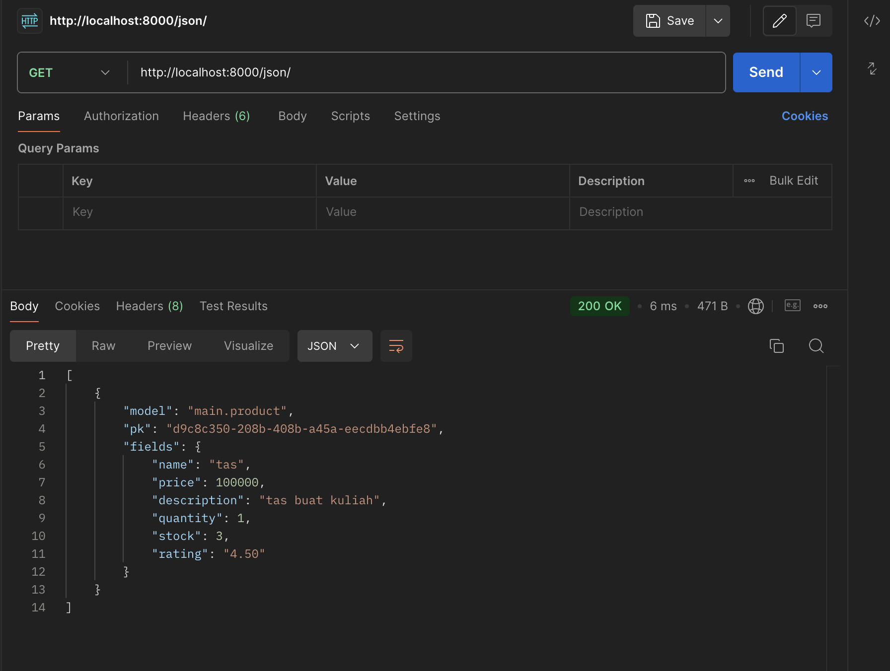

Link PWS: http://kayla-agrata-shopallday.pbp.cs.ui.ac.id
# Tugas 2
### 1. Jelaskan bagaimana cara kamu mengimplementasikan checklist di atas secara step-by-step (bukan hanya sekadar mengikuti tutorial).
Hal pertama yang harus dilakukan adalah membuat sebuah direktori utama yang diberi nama shop-all-day. Kemudian, langkah selanjutnya adalah mengaktifkan virtual environment. Setelah itu, saya membuat file requirements.txt yang diisi dengan beberapa dependencies dan melakukan instalasi terhadap dependencies tersebut.

1) Setup Proyek Django
Melakukan instalasi django dan membuat project shop_all_day dengan perintah 'django-admin startproject shop_all_day'. 
2) Menambahkan Berkas .gitignore
Membuat berkas .gitignore yang digunakan sebagai konfigurasi pada repositori git untuk memilah berkas apa saja yang perlu diabaikan seperti env dan db.sqlite3.
3) Setting Github bernama shop-all-day
Menginisiasi direktori lokal shop-all-day sebagai repositori git. Setelah itu melakukan add, commit, dan push dari direktori lokal
4) Membuat Aplikasi Django
Membuat aplikasi baru dengan nama 'main' dan mendaftarkan aplikasi di 'settings.py' agar Django dapat mengenali aplikasi tersebut.
5) Membuat berkas template html
Membuat direktori baru bernama template lalu mengisinya dengan berkas 'main.html'.
6) Membuat Model
Mengubah berkas 'models.py' sesuai dengan ketentuan soal. Setelah itu, melakukan migrasi model agar perubahan model yang terjadi dapat diketahui oleh server.
7) Membuat views
Melakukan integrasi model, views, dan template pada berkas 'views.py'. Fungsinya untuk mengatur http agar dapat mengembalikan tampilan yang sesuai. Lalu melakukan modifikasi pada template agar dapat menampilkan data.
8) Melakukan routing URL
Menambahkan 'urls.py' pada direktori main agar dapat mengambil modul main views sebagai tampilan ketika mengakses url. 

### 2. Buatlah bagan yang berisi request client ke web aplikasi berbasis Django beserta responnya dan jelaskan pada bagan tersebut kaitan antara urls.py, views.py, models.py, dan berkas html.
Link bagan : https://drive.google.com/file/d/1-mmPskH5lrDAkIWCBSBKqGPpG39R2JCW/view?usp=sharing
Bagan tersebut menggambarkan konsep Django yaitu MVT (Model-Views-Template)
Model berfungsi untuk mengelola data dan berinteraksi dengan database. Isi dari model biasanya class yang berhubungan dengan aplikasi tersebut. Views berfungsi untuk mengambil data yang diperlukan dari model, mengirimkan data tersebut ke template, dan mengelola data apa yang dapat ditampilkan ke user. Template sebagai tampilan data yang diberikan oleh views pada user dengan format yang ditentukan.

### 3. Jelaskan fungsi git dalam pengembangan perangkat lunak!
1) Untuk berkolaborasi
Git memungkinkan para pengembang untuk bekerja sama dengan pengembang  atau tim lain dalam satu repositori utama. Git akan menyimpan setiap perubahan yang dilakukan dan dapat melakukan sinkronisasi dengan repositori lainnya. Adanya branch pada git memungkinkan para pengembang untuk mengerjakan fitur-fitur yang berbeda secara terpisah.  Sumber : domainesia.com
2) Melacak Perubahan
Setiap perubahan yang dilakukan pada kode tercatat, hal ini dapat memudahkan para pengembang untuk mempercepat proses debugging. Sumber : revou.co
3) Menjadi backup
Kode tersimpan dalam repositori remote di Github sehingga terdapat backup apabila terjadi sesuatu yang tidak diinginkan. Sumber : dte.telkomuniversity.ac.id

### 4. Menurut Anda, dari semua framework yang ada, mengapa framework Django dijadikan permulaan pembelajaran pengembangan perangkat lunak?
Django menggunakan bahasa python yang mudah dimengerti oleh para pemula dalam pemrograman. Django juga memiliki dokumentasi yang lengkap sehingga mempermudah proses pembelajaran. Django juga memiliki komunitas yang banyak sehingga pemula dalam pemrograman dapat mendapatkan bantuan. Django juga membantu pemula untuk memahami struktur aplikasi dengan baik karena adanya pola Model-View-Template.

### 5. Mengapa model pada Django disebut sebagai ORM?
ORM adalah singkatan dari Object-Relational-Mapping. Model pada Django disebut sebagai ORM karena Django ORM memiliki tugas untuk memetakan objek ke struktur basis data relasional dan mendefinisikan model python dalam tabel. Tabel ini dapat berinteraksi dengan data menggunakan operasi objek python tanpa adanya keterlibatan SQL. Sumber : rumahcoding.co.id

# Tugas 3 : Implementasi Form dan Data Delivery pada Django
### 1. Jelaskan mengapa kita memerlukan data delivery dalam pengimplementasian sebuah platform?
Data delivery memiliki peran yang penting dalam implementasi sebuah platform. Beberapa alasannya adalah sebagai berikut:
1. User experience yang responsif dan akurat
Data delivery diperlukan karena data perlu dikirimkan secara efisien agar user dapat mengakses informasi dengan cepat dan akurat. Data delivery membuat interaksi user dengan platform menjadi baik.
2. Real-time data delivery
Beberapa platform memerlukan pengiriman data secara real-time untuk menyesuaikan dengan input pengguna. Data delivery secara real-time memastikan bahwa pengguna dapat selalu melihat pembaruan data atau konten terbaru.
3. Integrasi
Data delivery yang efektif memastikan bahwa komunikasi antara platform dengan sistem lain misalnya sistem pembayaran eksternal berjalan dengan lancar.
4. Security
Data delivery yang dikontrol dengan baik membantu memastikan bahwa data yang dikirimkan aman.

### 2. Menurutmu, mana yang lebih baik antara XML dan JSON? Mengapa JSON lebih populer dibandingkan XML?
Menurut saya, JSON lebih baik dari XML. Dalam pengembangan web, umumnya JSON dianggap lebih baik, itulah alasan mengapa JSON lebih populer dibandingkan XML. Berikut adalah beberapa alasan mengapa JSON lebih populer dan sering digunakan:
1. Format dan Syntax Lebih Ringkas dan Simpel
JSON memiliki struktur yang lebih ringkas daripada XML. JSON menggunakan pasangan key dan value untuk membuat struktur. 'Key' adalah string, yang akan mengidentifikasi pasangan tersebut. Value adalah informasi yang diberikan pada key tersebut. Misalnya, “NumberProperty”: 10. Dalam hal ini, “NumberProperty” adalah key, dan 10 adalah value. Struktur ini mudah dibaca oleh programmer maupun orang awam.
2. Kemudahan dalam Parsing
Melakukan parsing XML harus dengan parser XML. Hal ini sering memperlambat dan mempersulit prosesnya.
Sementara itu, JSON dapat dilakukan parsing menggunakan fungsi JavaScript standar. Hal ini membuat JSON lebih mudah diakses. Karena perbedaan sintaks dan ukuran file, JSON juga dapat diparsing lebih cepat daripada XML.
Sumber : https://aws.amazon.com/compare/the-difference-between-json-xml/

### 3. Jelaskan fungsi dari method is_valid() pada form Django dan mengapa kita membutuhkan method tersebut?
Method is_valid() digunakan untuk melakukan validasi pada setiap field dalam form, dan didefinisikan dalam kelas Form Django. Method ini memerika apakah semua field dalam form sudah terisi dengan benar (misal apakah field name sudah diisi). Method ini mengembalikan True jika data valid dan menempatkan semua data ke dalam atribut cleaned_data. Alasan is_valid() dibutuhkan adalah agar kita tidak perlu memeriksa validitas input satu per satu secara manual. Selain itu, method ini juga dapat membantu kita untuk memastikan bahwa data tersebut valid sebelum disimpan ke database.
Sumber : https://www.javatpoint.com/django-form-validation

### 4. Mengapa kita membutuhkan csrf_token saat membuat form di Django? Apa yang dapat terjadi jika kita tidak menambahkan csrf_token pada form Django? Bagaimana hal tersebut dapat dimanfaatkan oleh penyerang?
Dalam Django, kita membutuhkan csrf_token untuk melindungi user dari serangan yang dikenal sebagai Cross-Site-Request-Forgery(CSRF). Jika kita tidak menambahkan csrf_token, attacker dapat memanfaatkan misalnya sesi login user untuk mengirimkan permintaan yang berbahaya tanpa kesadaran user. Pada serangan CSRF, attacker mengirimkan email atau sms yang mengandung link untuk mengelabui user yang sudah authenticated pada website untuk melakukan tindakan yang tidak diinginkan seperti transfer dana atau penggantiam email tanpa sepengetahuan user. Tanpa validasi csrf_token, aplikasi Django tidak bisa membedakan antara permintaan dari pengguna dan permintaan berbahaya dari pihak ketiga.
Sumber : https://www.geeksforgeeks.org/csrf-token-in-django/

### 5. Jelaskan bagaimana cara kamu mengimplementasikan checklist di atas secara step-by-step (bukan hanya sekadar mengikuti tutorial).
1. Membuat forms.py
Membuat file forms.py pada direktori main, file diisi dengan model yang sudah dibuat sebelumnya yaitu product.
2. Implementasi fungsi create product pada views.py untuk dan menampilkannya di template HTML
Melakukan import forms yang baru dibuat dan menambahkan import redirect. Lalu membuat fungsi baru yaitu create_product agar dapat melakukan validasi input form dan menambahkan data yang disubmit secara otomatis. Selanjutnya, pada fungsi `show_main`, ditambahkan kode `Product.objects.all()` untuk mengambil semua objek dari model Product yang ada di database. Nilai yang diambil dari `Product.objects.all()` disimpan dalam variabel `products` dan dimasukkan ke dalam context, kemudian dikirim ke template HTML agar dapat ditampilkan.
3. Melakukan routing URL
Melakukan import fungsi `create_product` pada urls.py dan tambahkan path untuk mengakses fungsi `create_product`.
4. Menampilkan pada template HTML
Membuat file HTML baru dengan nama create_product.html pada direktori main/templates dengan `<form method="POST>` untuk menandakan block untuk form yang menggunakan metode POST, `` yang berfungsi untuk mencegah serangan CSRF, dan button untuk submit form.
5. Membuat fungsi untuk mengembalikan data dalam bentuk XML dan JSON
Masuk ke file views.py dan membuat 4 fungsi untuk melihat data JSON dan XML yaitu `show_xml`, `show_json`, `show_xml_by_id`, dan `show_json_by_id`.
6. Melakukan routing URL 
Menambahkan path untuk menampilkan page yang dapat melihat database yang ditampilkan dalam bentuk JSON maupun XML
7. Melakukan push ke pws dan github

### Postman Documentation
`show_xml`

`show_json`

`show_xml_by_id`

`show_json_by_id`

# Tugas 4 : Implementasi Autentikasi, Session, dan Cookies pada Django
### 1. Apa perbedaan antara `HttpResponseRedirect()` dan `redirect()`?
Dalam Django, `HttpResponseRedirect()` dan `redirect()` digunakan untuk mengirim user ke URL yang berbeda. Akan tetapi, keduanya memiliki perbedaan yang signifikan:
- Dalam segi return type `HttpResponseRedirect()` membuat HTTP response object secara langsung yang redirect ke URL yang sudah dispesifikasi. Di sisi lain, `redirect()` adalah sebuah shortcut function yang juga return sebagai `HttpResponseRedirect()` tetapi lebih fleksibel dalam menerima argumen. Karena `redirect()` bisa menerima URL, nama view, dan model instance.
- Dalam segi parameter, ketika menggunakan `redirect()` bisa pass positional dan named parameters yang nantinya akan digunakan untuk membangun URL. Jadi, dengan hanya memberikan nama view atau URL tujuan pada `redirect()`, Django secara otomatis akan mengonversinya menjadi URL yang sesuai. Ini sangat memudahkan ketika Anda menggunakan namespace atau view name, seperti dalam kasus redirect('main:show_main').

### 2. Jelaskan cara kerja penghubungan model Product dengan User!
Dalam Django, untuk menghubungkan model Product dengan User dibutuhkan membuat foreign key relationship dalam model Product yang merujuk ke model User. ForeignKey digunakan untuk membuat relasi satu ke banyak (one-to-many) antara Product dan User, di mana satu user dapat memiliki banyak product. `on_delete=models.CASCADE `artinya jika pengguna dihapus, semua product yang dimiliki oleh user tersebut juga akan dihapus.

### 3. Apa perbedaan antara authentication dan authorization, apakah yang dilakukan saat pengguna login? Jelaskan bagaimana Django mengimplementasikan kedua konsep tersebut.
- Authentication : Sebuah proses yang melakukan verifikasi menentukan siapa user. Ketika user log in dengan memberikan kredensial mereka seperti username dan password, maka sistem akan cek apakah kredensial tersebut tersimpan dalam data untuk mengkonfirmasi identitias mereka.
- Authorization : Ketika user sudah authenticated, authorization menentukan resource atau action apa yang user bisa akses atau lakukan berdasarkan role mereka.

Dalam implementasi Django, authentication dilakukan dengan cara ketika user log in menggunakan authentication views Django, kredensial yang mereka berikan akan dicek terhadap database. Django akan membuat session bagi user tersebut apabila kredensial yang diberikan valid. Sementara itu, authorization dilakukan permission classes dan decorators. Sebagai contoh menggunakan `@login_required` akan memastikan bahwa hanya authenticated user yang bisa mengakses beberapa view jadi user harus login terlebih dahulu agar bisa mengakses suatu halaman web.

### 4. Bagaimana Django mengingat pengguna yang telah login? Jelaskan kegunaan lain dari cookies dan apakah semua cookies aman digunakan?
Django menggunakan session untuk mengingat user yang telah log in. Ketika log in user berhasil maka :
- Membuat session : Sebuah session dibuat dari sisi server dan sebuah identifier/session ID disimpan dalam cookie di browser user.
- Cookie Management : Cookie memungkinkan Django untuk mengidentifikasi user yang kembali tanpa memerlukan mereka untuk log in kembali sebelum session mereka expire atau user melakukan log out.

Kegunaan cookie selain untuk proses authentication adalah:
- Melacak user behavior karena cookie bisa menyimpan preferensi pengguna atau melacak aktivitas pengguna pada session
- Menyimpan preferensi karena cookie bisa mengingat preferensi user settings seperti bahasa pilihan dan theme.

Tidak semua cookie aman untuk digunakan, ini tergantung bagaimana keamnannya diimplementasikan. Untuk memastikan keamanan dalam penggunaan cookies, Django menyediakan dua opsi penting, yaitu HttpOnly dan Secure, yang dapat diterapkan pada cookies untuk melindungi data pengguna dari potensi risiko keamanan
HttpOnly adalah atribut yang mencegah cookies diakses oleh kode JavaScript di sisi klien.
Ketika atribut HttpOnly diaktifkan, cookie tersebut hanya dapat dibaca dan dimodifikasi oleh server melalui protokol HTTP/HTTPS. Secure adalah atribut yang memastikan bahwa cookie hanya dikirimkan melalui koneksi HTTPS yang encrypted.

### 5. Jelaskan bagaimana cara kamu mengimplementasikan checklist di atas secara step-by-step (bukan hanya sekadar mengikuti tutorial).
1. Membuat Form Register dengan cara membuat fungsi register dalam views.py untuk membuat form register yang menghasilkan akun user ketika disubmit, lalu membuat file html untuk register sebagai templates. Terakhir menambahkan path dalam urlpatterns agar bisa mengakses fungsi register.
2. Membuat fungsi login dan logout, ketika login akan ada cookie last_login untuk melihat kapan terakhir kali user login, lalu untuk fungsi log_out menambahkan `response.delete_cookie('last_login')` untuk menghapus cookie ketika user logout.
3. Menambahkan `'last_login': request.COOKIES['last_login']` berfungsi menambahkan informasi cookie last_login pada webpage
4. Menambahkan path url login dan logout agar dapat mengarahkan permintaan user ke view yang sesuai
5. Menambahkan decorator pada views.py `@login_required(login_url='/login')` agar halaman main hanya dapat diakses oleh pengguna yang sudah login
6. Menghubungkan product dengan user dengan menggunakan ForeignKey dalam models.py agar sebuah produk pasti berhubungan dengan sebuah user. Setelah itu, melakukan migrate untuk menyimpan perubahan yang dilakukan pada model.

# Tugas 5 : Desain Web menggunakan HTML, CSS dan Framework CSS
### 1. Jika terdapat beberapa CSS selector untuk suatu elemen HTML, jelaskan urutan prioritas pengambilan CSS selector tersebut!
Inline style memiliki prioritas tertinggi. Inline style didefinisikan secara langsung pada HTML menggunakan `style`. Contoh `<h1 class="class1" style="color: yellow;"</h1>`. Prioritas kedua adalah ID Selectors. ID selector memiliki sifat unik terhadap suatu halaman dan ada simbol `#`. Contoh `#title {color: red;}`. Prioritas ketiga adalah Class Selectors. Class selectors diatandari dengan `.`, contoh `.class2 { color : aqua;}`.  Prioritas terakhir adalah element selector, selector ini menarget HTML elements secara spesifik. Contohnya adalah `p {color: black;}`.

### 2. Mengapa responsive design menjadi konsep yang penting dalam pengembangan aplikasi web? Berikan contoh aplikasi yang sudah dan belum menerapkan responsive design!
Menurut saya, responsive design menjadi konsep yang krusial dalam pengembangan aplikasi web karena saat ini ada banyak sekali device dan juga jenis browser yang digunakan untuk mengakses internet. Sehingga dibutuhkan responsive design agar aplikasi web dapat memberikan viewing experience yang optimal. Beberapa alasan utama mengapa responsive design penting adalah, yang pertama adalah dalam sisi user experience. Responsive design akan meningkatkan user experience dengan memastikan konten dapat dibaca dan dinavigasi dengan mudah dalam semua device. UX yang baik akan meningkatkan peluang bahwa user akan kembali menggunakan website tersebut. Selanjutnya, responsive design juga dapat meningkatkan search engine optimization, karena memiliki satu URL untuk semua device, hal ini akan menguntungkan karena Google memprioritaskan mobile-friendly website untuk ranking website mereka. Responsive design juga mempercepat kinerja dan kecepatan kerja karena dengan resposive design, satu set kode dapat digunakan untuk semua perangkat. Hal ini juga dapat menekan harga pembuatan karena membuat website untuk berbagai device dapat menjadi mahal dan membutuhkan waktu lama.
Contoh aplikasi yang sudah menerapkan responsive design : 
`https://www.sociolla.com/`, `https://beyondthevines.co.id/`, `https://aws.amazon.com`
Contoh aplikasi yang belum menerapkan responsive design:
`https://main.semarangkab.go.id/`, `https://jatimprov.go.id`, `https://academic.ui.ac.id`

### 3. Jelaskan perbedaan antara margin, border, dan padding, serta cara untuk mengimplementasikan ketiga hal tersebut!
Margin adalah ruang yang terletak di luar border dari sebuah elemen, memiliki fungsi untuk membuat jarak antara elemen yang berdekatan. Border merupakan sebuah garis yang mengelilingi atau membungkus konten dan padding-nya. Border memerikan batas visual di sekitar elemen. Padding adalah ruang di dalam batas elemen, antara batas dan konten elemen. Fungsi padding yaitu menciptakan jarak antara konten dan tepi elemen atau mengosongkan area di sekitar konten. 
/* Example */
.box {
    margin: 20px;          /* Sets margin around the box */
    padding: 15px;         /* Sets padding inside the box */
    border: 2px solid black; /* Sets a solid black border */
}

### 4. Jelaskan konsep flex box dan grid layout beserta kegunaannya!
Flexbox adalah sebuah layout model yang one-dimensional untuk membuat distribusi ruang antar item. Flexbox berhubungan dengan tata letak dalam satu dimensi, baik sebagai baris atau kolom. Terdapat 2 sumbu pada flexbox yaitu main axis dan cross axis. Main axis ditentukan oleh flex-direction, sementara cross axis tegak lurus terhadap main axis. Flexbox bisa digunakan untuk membuat navigation bar horizontal dan melakukan alignment (penyelarasan) ketika mengelola labels dan input fields pada forms. Flexbos bisa juga digunakan untuk mengatur card component dalam grid responsif yang menyesuaikan berdasarkan ukuran layar.
Grid layout adalah sistem tata letak dua dimensi yang memungkinkan developer membuat tata letak kompleks yang melibatkan baris dan kolom. Grid Layout memberikan kontrol yang lebih baik dibandingkan Flexbox untuk desain tata letak yang rumit. Grid layout memungkinkan developer untuk membuat elemen dari child grid container memposisikan dirinya sehingga benar-benar tumpang tindih dan berlapis. Item dapat ditempatkan di mana saja di grid menggunakan properti seperti grid-column dan grid-row, hal ini memungkinkan kontrol tata letak yang tepat. Grid layout cocok digunakan untuk web page layout karena bisa membuat sebuah sebuah halaman yang terdiri dari headers, footers, sidebars, dan content areas. Grid layout juga cocok digunakan untuk dashboard data yang kompleks karena grid layout dapat mengelola berbagai komponen secara terstruktur.

### 5. Jelaskan bagaimana cara kamu mengimplementasikan checklist di atas secara step-by-step (bukan hanya sekadar mengikuti tutorial)!
1. Membuaut fitur edit product dengan cara membuat fungsi edit_product pada views.py dan menambahkan path url edit product pada url patterns di urls.py.
2. Membuat fitur delete product dengan cara membuat fungsi delete_product yang menerima parameter request dan id pada views.py lalu menambahkan path url delete product pada url patterns di urls.py.
3. Membuat file html untuk edit product dan membuat file html untuk navigation bar.
4. Membuat konfigurasi static files pada settings.py dengan menambahkan middleware WhiteNoise dan mengonfigurasikan STATIC_ROOT, STATICFILES_DIRS, dan STATIC_URL.
5. Menambahkan styles denga Tailwind dengan cara menambahkan folder static dengan isinya global.css dan script tailwind ke base.html.
6. Melakukan styling pada halaman login dan register.
7. Melakukan styling pada halaman create_product dan edit_product.
8. Melakukan styling pada card_info, card_product, main, dan navbar, serta memastikan semua fitur dapat digunakan. 

# Tugas 6: JavaScript dan AJAX
### 1. Jelaskan manfaat dari penggunaan JavaScript dalam pengembangan aplikasi web!
Javascript bermanfaat dalam pengembangan web karena kemampuannya untuk ekseksui dalam sisi client sehingga meminimalisir ketergantungan terhadap server. Ini artinya ketika user mengakses website, kode Javascript berjalan secara direct dalam browser mereka sehingga loading times lebih cepat dan juga terjadi interaksi secara dinamis tanpa komunikasi server secara konstan. Javascript juga dapat mengelola data transfer dan memastikan bahwa informasi yang  berukuran besar dapat ditransmisikan dengan delay yang minimal. Javascript dapat dioperasikan dengan bahasa pemrograman lain  seperti HTML dan CSS yang memungkinkan developers untuk membuat web yang interaktif tanpa masalah compability.
Javascript juga memiliki fitur AJAX yang memungkinkan aplikasi untuk mengirimkan dan mendapatkan data dari server tanpa harus refresh seluruh halaman.

### 2. Jelaskan fungsi dari penggunaan await ketika kita menggunakan fetch()! Apa yang akan terjadi jika kita tidak menggunakan await?
`await` digunakan pada asynchronous function untuk menunggu hasil eksekusi dari fetch.  Jadi ketika kita memanggil await fetch (url), kode akan berhenti pada baris tersebut hingga operasi fetch selesai. Ini artinya function akan menunggu respon dari server sebelum lanjut ke baris berikutnya dalam kode. Misalnya dalam kode `main.html` terdapat `const products = await getProductEntries()` ini artinya program memanggil function `getProductEntries()` yang akan return sebuah Promise. Penggunaan `await` disini artinya kode akan pause pada baris ini sampai `getProductEntries` selesai diekseksusikan. Jika `getProductEntries` berhasil maka akan di-assign terhadap variabel `products`.
Jika tidak menggunakan `await` maka `fetch` akan return langsung sebuah Promise, kode yang berikutnya akan langsung eksekusi tanpa menunggu operasi `feth` selesai. Ini bisa menghasilkan hasil yang tidak sesuai dengan ekspektasi, terutama ketika ingin mengakses data yang ternyata belum di-fetch.

### 3. Mengapa kita perlu menggunakan decorator csrf_exempt pada view yang akan digunakan untuk AJAX POST?
CSRF adalah jenis serangan keamanan web di mana attacker dapat mengirimkan permintaan yang unauthorized atas nama user yang sudah terautentikasi oleh aplikasi web. Decorator csrf_exempt digunakan untuk membebaskan atau mengecualikan pemeriksaan token CSRF pada view. Jika tidak menggunakan @csrf_exempt pada view yang menangani permintaan AJAX POST, permintaan tersebut akan ditolak jika tidak menyertakan token CSRF yang valid.  

### 4. Pada tutorial PBP minggu ini, pembersihan data input pengguna dilakukan di belakang (backend) juga. Mengapa hal tersebut tidak dilakukan di frontend saja?
Kode frontend seperti HTML, CSS, dan Javascript berjalan di sisi client yang artinya dapat dimanipulasi kodenya. Contoh manipulasinya adalah pengguna bisa menghapus validasi yang mencegah untuk pengiriman input berbahaya pada serangan XSS (Cross-Site-Scripting) jika data tidak dibersihkan di backend. Backend berfungsi sebagai pengendali utama data yang masuk sehingga dengan melakukan pembersihan data ini memastika bahwa data yang disimpan pada basis data benar-benar valid dan aman. 

### 5. Jelaskan bagaimana cara kamu mengimplementasikan checklist di atas secara step-by-step (bukan hanya sekadar mengikuti tutorial)!
1. Menambahkan error message pada aktivitas login dengan menambahkan else yang berisi pesan error `"Invalid username or password. Please try again."`
2. Membuat fungsi pada views.py untuk menambahkan product yaitu fungsi `add_product_ajax` dengan decorator `@csrf_exempt` dan `@require_POST` lalu menambahkan routing yaitu dengan cara menambahkan path url-nya dalam urlpatterns pada urls.py. Pada views.py, menambahkan `strip_tags` pada variabel name dan description untuk menghilangkan tag HTML yang terdapat pada data yang dikirimkan user melalui request POST
3. Melakukan fetch terhadap data-data product yang dimiliki user dengan cara menghapus kode `products = Product.objects.filter(user=request.user)` dan `'products : products'` pada context lalu mengganti `data = Product.objects.all()` dengan ` data = Product.objects.filter(user=request.user)` pada fungsi `show_xml` dan `show_json` karena sekarang objek-objek product akan didapatkan dari endpoint `/json`.
4. Membuat fungsi `getProductEntires()` dan `refreshProductEntries` pada block script pada main.html dengan menyesuaikan htmlString dengan card yang saya desain.
5. Membuat modal untuk menambahkan product dengan menambahkan fungsi `showModal()` dan `hideModal()` serta menambahkan button `Add Product by AJAX` dengan targetnya yaitu curdModal. 
6. Menambahkan fungsi `addProduct Entry()` dengan method POST serta menambahkan event listener pada form yang ada dengan memanggil `addProductEntry`. 
7. Menambahkan fungsi `clean_name` dan `clean_desc` pada forms.py serta menambahkan skrip `src="https://cdn.jsdelivr.net/npm/dompurify@3.1.7/dist/purify.min.js"` pada block meta serta menambahkan `const name = DOMPurify.sanitize(item.fields.name);` dan juga `const description = DOMPurify.sanitize(item.fields.description);` pada fungsi `refreshMoodEntries` untuk membersihkan data dengan DOMPurify pada frontend. 